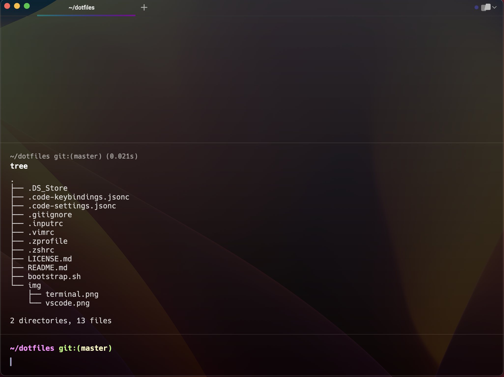
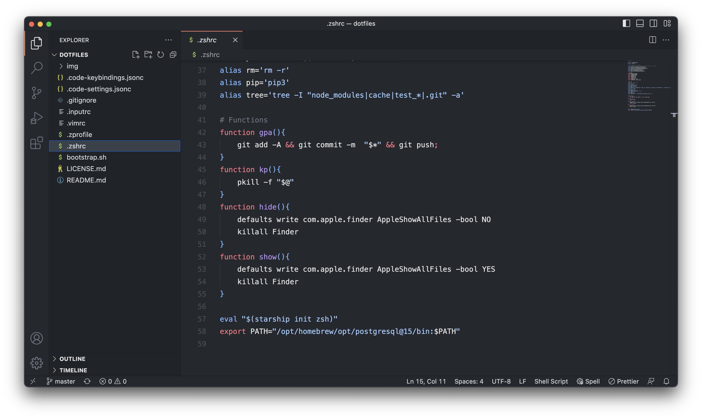

# dotfiles

Shell, terminal emulator, editor, and OSX setup.




# Installation

### Backup your Mac

`bootstrap.sh` installs Homebrew, various terminal and binary applications, and overrides a number of defaults on Mac OSX.

### Clone & run `bootstrap.sh`

```bash
cd ~
git clone git@github.com:kevinschaich/dotfiles.git 
chmod u+x ~/dotfiles/bootstrap.sh 
~/dotfiles/bootstrap.sh
```

As one command:

```bash
cd && git clone git@github.com:kevinschaich/dotfiles.git && chmod u+x ~/dotfiles/bootstrap.sh && ~/dotfiles/bootstrap.sh
```

## License

MIT © [Kevin Schaich](https://kevinschaich.io)
